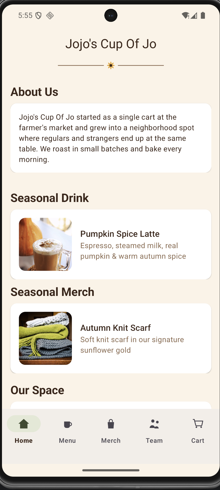
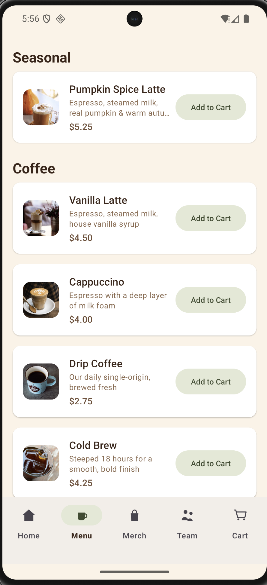
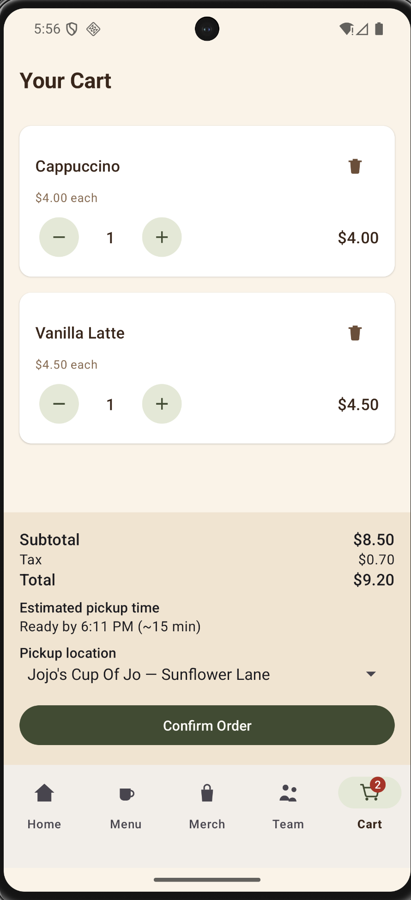

# Jojo's Cup Of Jo

An Android app for a coffee shop: browse the seasonal home highlights, order from the menu and
merch shelf, meet the team, and check out from a cart with a mock pickup-time estimate and order
total.

## Screenshots

| Home | Menu | Cart |
| --- | --- | --- |
|  |  |  |

## Features

- Home tab with store hours/location, about-us and story blurbs, and a seasonal drink/merch
  highlight card that jumps straight to that item's tab
- Menu and Merch tabs (same product list UI) with items grouped into headed sections by category
- Team tab with roster and avatar placeholders
- Cart with quantity editing, tax, order total, and a "ready by" pickup time estimate
- Real product photography, with a placeholder icon for any product without a photo yet

## Tech Stack

- Android, Java, Views + XML (Material3, ViewBinding)
- Single-module Gradle project (`:app`), AGP 9.4.1 / Gradle 9.6
- No backend yet — all content comes from `SampleDataProvider`

## Getting Started

### Prerequisites

- Android Studio compatible with AGP 9.4.1 / Gradle 9.6
- JDK 25 (auto-provisioned via the foojay resolver; no manual install needed)
- minSdk 28 device or emulator

### Build & Run

```bash
./gradlew installDebug   # build + install on a connected device/emulator
```

See `CLAUDE.md` for the full command reference (tests, lint, single-test invocations).

## Project Structure

```
com/example/jojos_cup_of_jo/
├── MainActivity.java          — hosts the 5 tabs, implements TabHost
├── data/                      — SampleDataProvider, CartRepository
├── model/                     — Product, CartItem, TeamMember, StoreInfo
└── ui/                        — home/, product/, team/, cart/, util/
```

See `CLAUDE.md` for the full architecture notes (navigation, data flow, UI stack).

## Roadmap

- [ ] Web version
- [ ] In-store desktop POS
- [ ] Shared server-side database (sales, inventory, employees) backing all three clients
- [ ] Replace `SampleDataProvider` with a real data source

## License

All rights reserved. No license is granted for reuse or redistribution.
